# Phase 1 Architecture

The system separates acquisition, point-in-time transformation, statistical forecasting,
classification, evaluation, and publication. Dagster exposes the production asset dependencies;
the command-line stages provide deterministic local reproduction. DuckDB and Parquet are the
analytical store, while small CSVs form the stable Tableau interface.

```mermaid
flowchart LR
  A[SEC EDGAR public data] --> B[Immutable cache + SHA-256 manifests]
  M[FRED/ALFRED public data] --> B
  B --> C[Normalize XBRL facts and filing dates]
  C --> D[Reconstruct issuer FQ1-FQ4 and TTM]
  D --> E[Eligibility and certified 60-company universe]
  E --> F[Point-in-time company-quarter panel]
  F --> G[Three KPI forecasts: random walk and state space]
  F --> H[Leakage-safe fundamentals and peer features]
  G --> H
  H --> I[Expanding-window classifier experiments]
  I --> J[Frozen champion]
  J --> K[One-time 2023+ locked holdout]
  K --> L[Reconciled Tableau extracts]
  L --> N[Four-page Tableau workbook]
  J --> O[Model card and release audit]
  N --> O
```

## Temporal control

`decision_at` is the knowledge cutoff. Source availability, feature availability, and label
availability are stored separately. Training rows must have labels available before each fold
boundary. A four-quarter embargo prevents outcomes spanning a validation boundary from entering
training. Forecast preprocessing and classifier preprocessing are fitted within training folds.
The final holdout begins in 2023 and is opened only after the champion record is frozen and hashed.

## Modeling boundary

Stage 13 compares random walk, drift, local-level, local-linear-trend, and regression dynamic
linear models for interest coverage, free-cash-flow margin, and total-debt-to-assets. Stage 14
compares regularized logistic regression and constrained gradient-boosted trees across prescribed
feature increments. Stage 15 selects the champion using OOF PR-AUC with calibration, stability,
interpretability, and simplicity as supporting criteria.

## Delivery and governance

Stage 17 reduces model outputs to four documented public CSV contracts and runs exact Python-to-
Tableau reconciliation. The workbook uses relative paths only. Stage 18 validates the workbook
XML, required documentation, dependencies, lineage manifests, model evidence, privacy constraints,
and extract row counts, then hashes release-defining artifacts. Network ingestion is separate from
cached reproduction to respect public API policies and make normal rebuilds deterministic.
