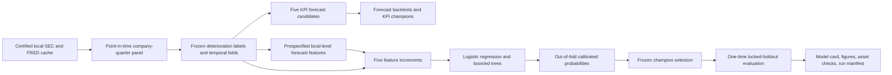

# Modeling Pipeline Lineage

Every transformation after the source cache is local and deterministic. Forecast features use
only the company history available at their decision date. Classifier preprocessing, feature
selection behavior, fitting, calibration, and threshold selection occur inside temporal training
folds. The locked holdout is accessed only after the champion selection record is written.
